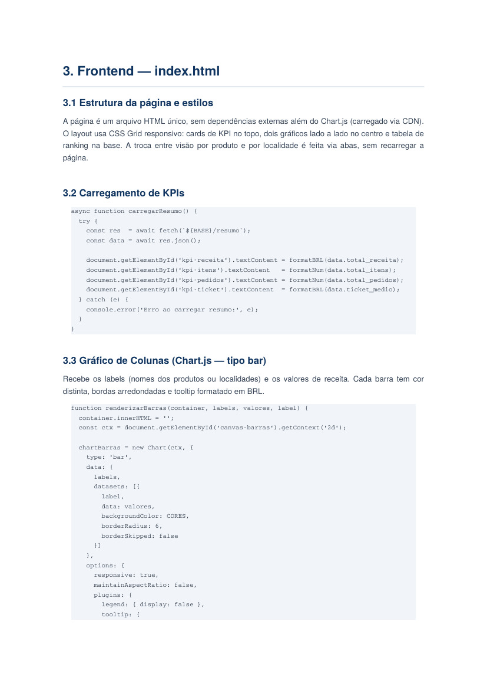
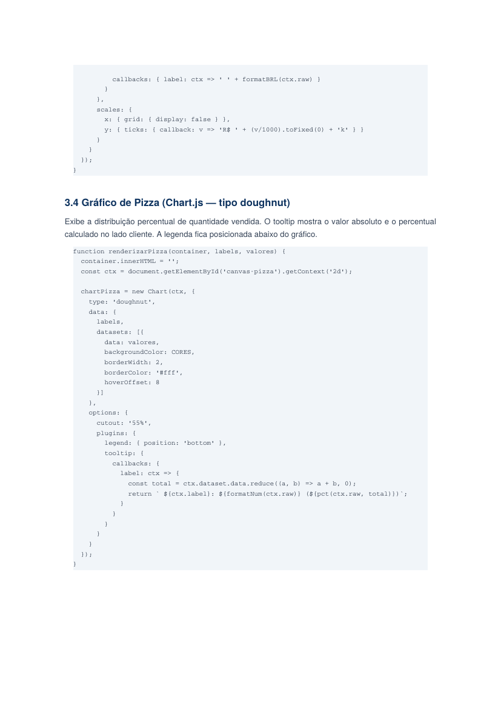
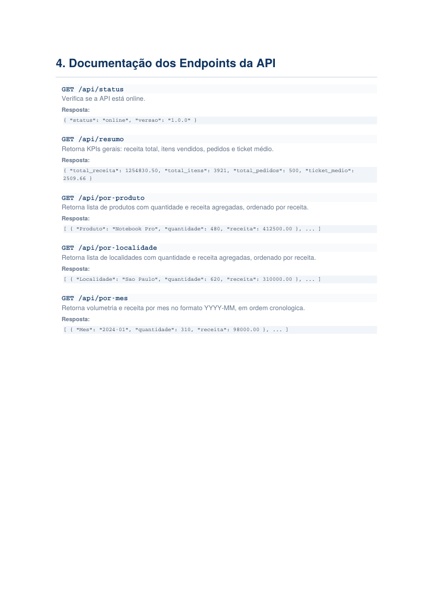

# 📊 BI Vendas — Painel Comercial


Painel de **Business Intelligence** para análise comercial, com API REST em **Flask + Pandas** processando dados de vendas e um dashboard interativo em **HTML + Chart.js** consumindo essa API.

## 🔗 Acesso rápido

- [Visão geral](#-visão-geral)
- [Screenshots](#-screenshots)
- [Tecnologias](#-tecnologias)
- [Como rodar](#-como-executar)
- [Endpoints da API](#-endpoints-da-api)
- [Estrutura do projeto](#-estrutura-do-projeto)

---

## 🎯 Visão geral

O **BI Vendas** transforma uma planilha de vendas em um painel analítico interativo. A API faz o processamento (agregações, KPIs, agrupamentos) com **Pandas**, e o frontend consome esses dados via `fetch` para montar gráficos dinâmicos com **Chart.js** — sem nenhum framework JS, HTML puro.

Principais indicadores calculados:
- Receita total, total de itens vendidos, total de pedidos e ticket médio
- Receita e volume por produto
- Receita e volume por localidade
- Evolução de receita e volume por mês

---

## 📸 Screenshots

**Visão geral do painel — KPIs e evolução mensal**


**Análise por produto**


**Análise por localidade**


---

## 🛠️ Tecnologias

| Camada | Tecnologia |
|---|---|
| Backend / API | Python 3, Flask, Flask-CORS |
| Processamento de dados | Pandas |
| Fonte de dados | Excel (`.xlsx`) via openpyxl |
| Frontend | HTML5, CSS3, JavaScript (fetch API) |
| Visualização | Chart.js |

---

## ✅ Como executar

### 1. Instalar dependências

```bash
cd backend
pip install -r requirements.txt
```

### 2. Iniciar o backend

```bash
python app.py
```

O servidor sobe em `http://localhost:5000`.

### 3. Abrir o frontend

Abra `frontend/index.html` diretamente no navegador (ele consome a API rodando em `localhost:5000`).

---

## 📡 Endpoints da API

| Método | Rota | Descrição |
|--------|------|-----------|
| GET | `/api/status` | Verifica se a API está online |
| GET | `/api/resumo` | KPIs gerais: receita total, itens, pedidos e ticket médio |
| GET | `/api/por-produto` | Volumetria e receita agregadas por produto |
| GET | `/api/por-localidade` | Volumetria e receita agregadas por localidade |
| GET | `/api/por-mes` | Volumetria e receita agregadas por mês |

### Exemplos de resposta

**GET /api/resumo**
```json
{
  "total_receita": 1254830.50,
  "total_itens": 3921,
  "total_pedidos": 500,
  "ticket_medio": 2509.66
}
```

**GET /api/por-produto**
```json
[
  { "Produto": "Notebook Pro", "quantidade": 480, "receita": 412500.00 },
  { "Produto": "Placa de Vídeo", "quantidade": 210, "receita": 289000.00 }
]
```

---

## 📁 Estrutura do projeto

```
bi_vendas/
├── README.md
├── apresentacao_bi_vendas.pdf   # Apresentação do projeto
├── assets/                      # Screenshots usados neste README
├── backend/
│   ├── app.py                   # API Flask (processamento com Pandas)
│   ├── requirements.txt         # Dependências Python
│   └── dados_comerciais.xlsx    # Base de dados de exemplo
└── frontend/
    └── index.html               # Painel visual (HTML + Chart.js)
```

---

## 📄 Substituindo os dados

Para usar seus próprios dados, coloque um arquivo `dados_comerciais.xlsx` na pasta `backend/` com as colunas:

`Data`, `Produto`, `Localidade`, `Quantidade`, `Preco_Unitario`, `Receita`

---

## 🚀 Melhorias futuras

- Filtros de data no dashboard (período customizável)
- Exportação dos relatórios em PDF/Excel direto pela interface
- Autenticação para proteger a API
- Migrar a fonte de dados de Excel para um banco de dados relacional
